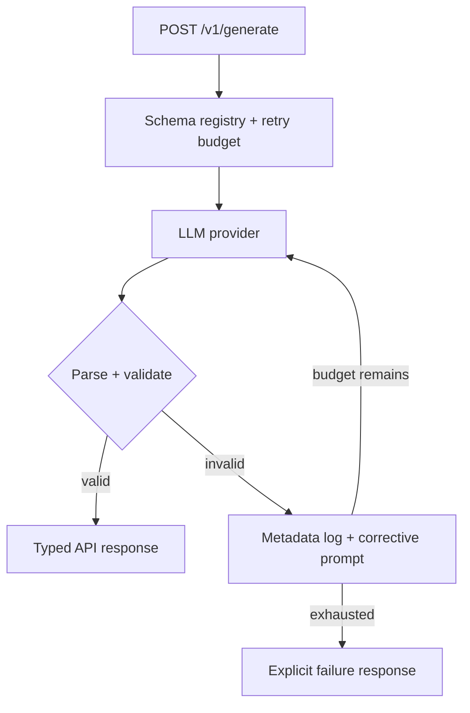
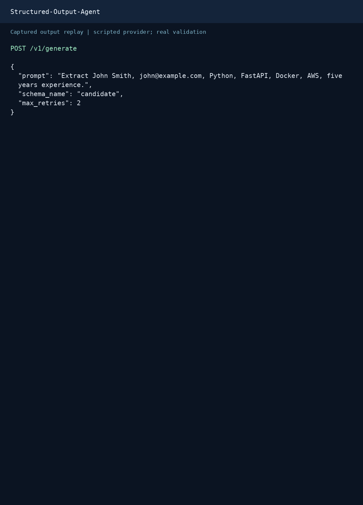

# Structured Output Agent

[](https://github.com/Ramesh-Murala/Structured-Output-Agent/actions/workflows/ci.yml)
[](LICENSE)
[](pyproject.toml)

A reliability layer for LLM-backed APIs: validate generated JSON against Pydantic schemas, feed the validation errors back as bounded corrective retries under a shared deadline, and return an explicit typed failure when correction is exhausted.

**Measured on the fault-injection suite:** 1/8 cases valid on the first response, 7/8 valid after correction, at a mean of 2.0 provider calls. Reproducible offline with a single command, no credentials required.

**Status:** a tested reference implementation, not a production-readiness claim. It demonstrates schema reliability; it does not verify the factual accuracy of generated fields, and the corrections measured above are scripted rather than live-model results.


## Visual proof

### Architecture



### Request and response replay



This GIF renders actual captured JSON as an animated transcript; it is not a screen recording. POST `/v1/generate` using FastAPI TestClient and the deterministic mock provider. Any `latency_ms` is a single local sample, not a performance benchmark.

### Evaluation results

| Measure | Recorded result |
|---|---:|
| Scripted cases | 8 |
| Valid on first response | 12.5% (1/8) |
| Valid after correction | 87.5% (7/8) |
| Mean provider calls | 2.0 |

[Recorded evaluation](evaluation/results.json). Eight scripted cases test control flow, including one intentional exhaustion. These are not live-model success rates.

### Sample request

```json
{
  "prompt": "Extract John Smith, john@example.com, Python, FastAPI, Docker, AWS, five years experience.",
  "schema_name": "candidate",
  "max_retries": 2
}
```

### Captured response

```json
{
  "success": true,
  "schema_name": "candidate",
  "attempts": 2,
  "validation_failures": [
    {
      "attempt": 1,
      "error_type": "pydantic_validation_error",
      "details": [
        {
          "type": "value_error",
          "loc": [
            "email"
          ],
          "msg": "value is not a valid email address: An email address must have an @-sign."
        },
        {
          "type": "list_type",
          "loc": [
            "skills"
          ],
          "msg": "Input should be a valid list"
        },
        {
          "type": "float_parsing",
          "loc": [
            "years_experience"
          ],
          "msg": "Input should be a valid number, unable to parse string as a number"
        }
      ]
    }
  ],
  "data": {
    "name": "John Smith",
    "email": "john@example.com",
    "skills": [
      "Python",
      "FastAPI",
      "Docker",
      "AWS"
    ],
    "years_experience": 5.0
  },
  "raw_output": null,
  "latency_ms": 1.533
}
```

Reproduce the capture and GIF from the repository root:

```bash
pip install -r requirements-dev.txt pillow
python docs/capture_demo.py
python docs/render_replay.py
```

The renderer needs DejaVu Sans Mono (on Debian/Ubuntu: `fonts-dejavu-core`). [Capture metadata](docs/assets/capture.json) records the source revision. [Request JSON](docs/assets/request.json) and [response JSON](docs/assets/response.json) are available separately.

## Engineering behavior

- Separate provider, parser, schema registry, retry, API, and logging layers.
- Candidate extraction, support-ticket classification, and product schemas.
- A total generation deadline shared across corrective attempts.
- Metadata-only validation logs: no raw generated text or Pydantic input/context values.
- API latency in milliseconds and attempt count for successful or exhausted runs.
- Explicit 503 responses for provider unavailability and 504 for the generation deadline.
- Offline fault-injection evaluation and CI on Python 3.11/3.12.

## Quick start without credentials

```bash
python -m venv .venv
source .venv/bin/activate  # Windows: .venv\Scripts\Activate.ps1
pip install -r requirements-dev.txt
pytest -q
ruff check .
python scripts/demo.py
python -m evaluation.run --output evaluation/results.json
```

For the API, copy `.env.example` to `.env`, configure the provider, then:

```bash
uvicorn app.main:app --reload
curl http://127.0.0.1:8000/health
curl -X POST http://127.0.0.1:8000/v1/generate \
  -H "Content-Type: application/json" \
  -d @examples/candidate_request.json
```

Swagger UI is at `http://127.0.0.1:8000/docs`. `docker compose up --build` starts the same API.

Use `LLM_PROVIDER=openai` with `OPENAI_API_KEY` and `OPENAI_MODEL` for live generation. The mock provider is a finite scripted sequence for demos/tests; restart the API to reset it. It is not a reusable substitute for an LLM service.

## Request and response

```json
{"prompt":"Extract Jane Doe, jane@example.com, Python, four years experience.","schema_name":"candidate","max_retries":2}
```

A successful response includes `success`, `data`, `attempts`, `validation_failures`, and `latency_ms`. Exhaustion returns `success=false` and `data=null` with HTTP 200; callers must inspect `success`. Raw output is always null, including on failure. This changes the old diagnostic behavior to avoid returning invalid generated content.

`MAX_RETRIES` defaults to 2 (three generation attempts). `REQUEST_TIMEOUT_SECONDS` defaults to 30 and applies across those attempts. The OpenAI SDK may perform its own transport retries inside that deadline; `attempts` counts agent-level generation calls, not HTTP requests or billable tokens.

## Reproducible evaluation

[`evaluation/cases.json`](evaluation/cases.json) injects malformed JSON, arrays, invalid emails, out-of-range values, invalid enums, and persistent failures. Run:

```bash
python -m evaluation.run --output evaluation/results.json
```

[`evaluation/results.json`](evaluation/results.json) compares first-response schema validity with validity after corrective attempts and reports generation-call overhead. Corrections are scripted; these results prove control-flow behavior, not the probability that a live model will fix an error. No live-model latency, cost, or accuracy is claimed. Runtime `latency_ms` measures a real request's elapsed time; live benchmarking remains separate work.

## Design decisions

**Application validation:** provider-independent business constraints and deterministic failure semantics. The current OpenAI adapter prompts with a schema; provider-native strict schema output is not implemented. Comparing native output constraints plus business validation against prompt-only output is a future experiment.

**Bounded retries:** validation failures get a corrective prompt. Provider availability failures are handled separately instead of consuming validation retries. The overall deadline bounds slow generation.

**Minimal logs:** persist timestamp, schema, attempt, error type/location, and output character count. Successful output is returned to the caller, not written to the validation log. Prompts and prior output still go to the model provider for generation/correction; this is not a comprehensive privacy guarantee.

## Remaining deployment work

- Authentication, request-rate limits, concurrency control, and multi-worker log collection.
- Live evaluation of factual correctness, schema validity, token usage, and latency distributions.
- Provider-native output constraints, usage accounting, and distributed tracing.
- Capacity/load testing and deployment-specific retention policies.

## Repository map

`app/llm/` provider adapters · `app/services/` validation/retry/logging · `app/schemas/` domain models · `tests/` failure-path and API tests · `evaluation/` reproducible fixtures/results · `.github/workflows/ci.yml` automated checks.

MIT license. See [CONTRIBUTING.md](CONTRIBUTING.md) and [SECURITY.md](SECURITY.md).
